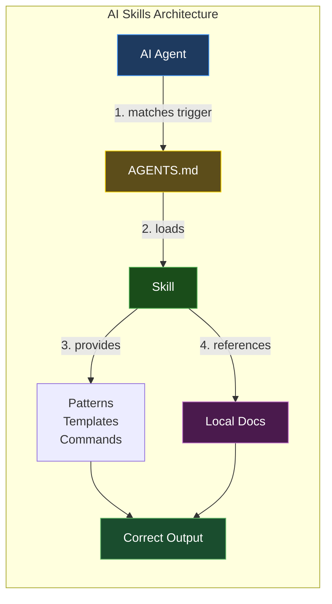
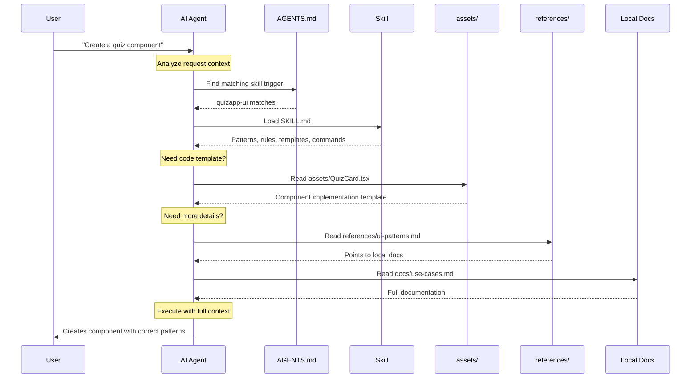
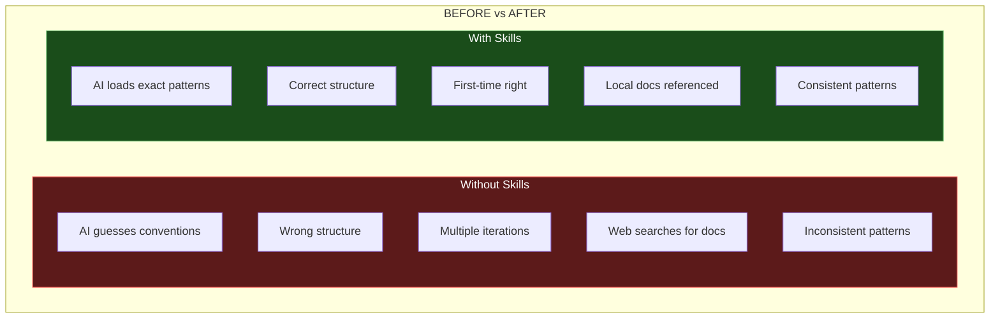
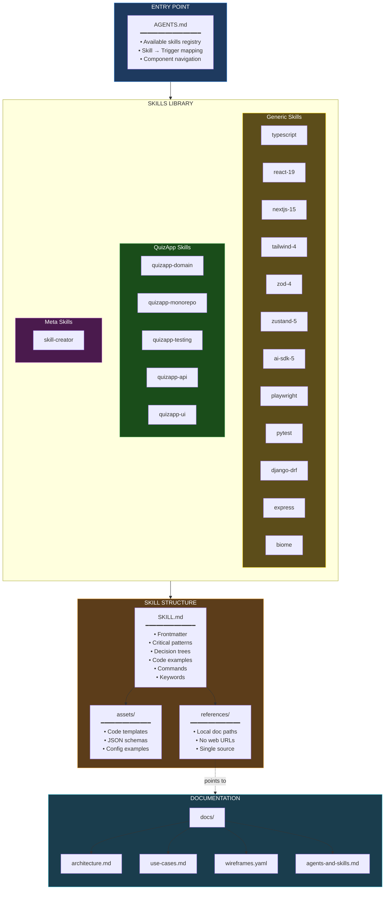

This guide explains the AI Skills system that provides on-demand context and patterns to AI agents working with the QuizApp codebase.

<Info>
**What are AI Skills?** Skills are structured instructions that help AI agents (Claude Code, Cursor, Copilot, etc.) understand QuizApp's conventions, patterns, and best practices.
</Info>

## Architecture Overview



## How It Works



## Before vs After



## Complete Architecture



## Skills Included

| Type | Skills |
|------|--------|
| **Generic** | typescript, react-19, nextjs-15, tailwind-4, zod-4, zustand-5, ai-sdk-5, playwright, pytest, django-drf, express, biome |
| **QuizApp** | quizapp-domain, quizapp-monorepo, quizapp-testing, quizapp-api, quizapp-ui |
| **Meta** | skill-creator |

**Total: 18 skills**

## Skill Structure

Each skill follows the [Agent Skills spec](https://agentskills.io):

```
skills/{skill-name}/
├── SKILL.md          # Patterns, rules, decision trees
├── assets/           # Code templates, schemas
└── references/       # Links to local docs (single source of truth)
```

## Key Design Decisions

1. **Self-contained skills** - Critical patterns inline for fast loading
2. **Local doc references** - No web URLs, points to `docs/*.md`
3. **Single source of truth** - Skills reference docs, no duplication
4. **On-demand loading** - AI loads only what's needed for the task
5. **Monorepo-aware** - Skills cover frontend, backend, and shared packages

## QuizApp-Specific Patterns

### Domain Skills (quizapp-domain)
- **Attempt lifecycle:** One active attempt per quiz, multiple completed
- **localStorage persistence:** Browser-based storage with specific keys
- **Question randomization:** Stable per-attempt order
- **Learning mode:** Explanation-first quiz flow

### API Skills (quizapp-api)
- **File-based storage:** Quizzes as JSON files in `backend/data/quizzes/`
- **Express patterns:** Route → Controller → Service architecture
- **Zod validation:** Schema validation for all quiz data
- **No database:** localStorage on frontend, JSON files on backend

### UI Skills (quizapp-ui)
- **Component organization:** `components/ui/` (shadcn/ui) + `components/quiz/` (app-specific)
- **Quiz flow:** QuestionView → FeedbackView → ResultsScreen
- **State management:** Zustand for session/attempts, React Query for server data
- **Styling:** Tailwind CSS 4 with shadcn/ui components

### Testing Skills (quizapp-testing)
- **Vitest:** Unit and integration tests
- **Supertest:** API endpoint testing
- **Co-location:** Tests live next to implementation (.spec.ts)
- **AAA pattern:** Arrange-Act-Assert structure

### Monorepo Skills (quizapp-monorepo)
- **pnpm workspaces:** Package management
- **Turborepo:** Task orchestration with caching
- **workspace:* protocol:** Internal dependencies
- **Shared package:** Common schemas and types

### Code Quality Skills (biome)
- **Unified linting:** Single tool for format + lint
- **Import organization:** Automatic sorting
- **Strict TypeScript:** No `any` types allowed
- **Pre-commit hooks:** Quality gates before commit

## Creating New Skills

Use the `skill-creator` meta-skill to create new skills that follow the Agent Skills spec. See `AGENTS.md` for the full list of available skills and their triggers.

### When to Create a New Skill

Create a skill when:
- Pattern is used 3+ times across the codebase
- Workflow has multiple steps requiring consistency
- Convention is project-specific (not generic)
- Domain knowledge needs preservation for future agents

Don't create a skill when:
- Pattern is used 1-2 times (document in AGENTS.md instead)
- Convention is generic and well-documented elsewhere
- Trivial pattern that doesn't need enforcement

## Auto-Invoke System

Skills are automatically invoked when AI detects matching actions:

**Example:**
```
User: "Implement quiz attempt persistence in localStorage"
AI detects: "Implementing quiz attempt persistence"
Skill activated: quizapp-domain
Result: Code follows attempt lifecycle, uses correct localStorage keys
```

See `AGENTS.md` for complete auto-invoke trigger mappings.

## Skill Maintenance

### Updating Skills
1. Update skill's `SKILL.md`
2. Increment `version` in frontmatter
3. Document breaking changes
4. Update references in `AGENTS.md`

### Adding Triggers
1. Edit skill's `metadata.auto_invoke` section
2. Update `AGENTS.md` Auto-Invoke table
3. Test with AI assistant

## Resources

- **Main Guide:** [AGENTS.md](/AGENTS.md) - Entry point for all AI agents
- **Skills Library:** [skills/README.md](/skills/README.md) - Skills documentation
- **Architecture:** [docs/architecture.md](/docs/architecture.md) - Technical decisions
- **Use Cases:** [docs/use-cases.md](/docs/use-cases.md) - Functional requirements
- **Wireframes:** [docs/wireframes.yaml](/docs/wireframes.yaml) - UI reference
- **Agent Skills Standard:** [https://agentskills.io](https://agentskills.io) - Open standard spec

---

**Remember:** Skills form the "agent operating system" for QuizApp. Together with AGENTS.md and docs/, they ensure AI agents produce consistent, high-quality code that follows project conventions.
